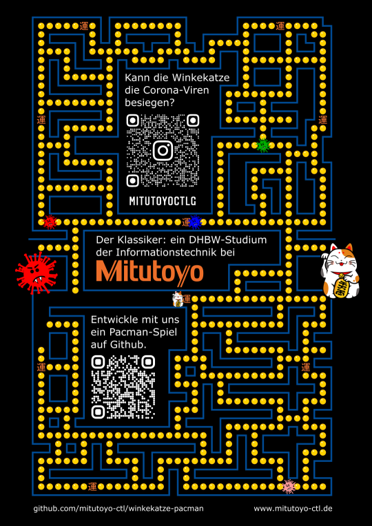

# Mitutoyo PacMan

Hier entsteht ein PacMan-Spiel, wie in unserer Werbung im Jahrbuch des [Leibniz-Gymnasiums in Rottweil](https://lg.rw.schule-bw.de) angekündigt.

Mitmachen kann jeder, egal ob Schüler, Lehrer, Eltern, Bekannte oder Verwandte. Wie? Wie bei Github üblich: Repository forken und Pull Requests einbringen. Schau unter [Issues](issues) nach, welche Aufgaben und Ideen es noch zu erledigen gibt.

Unsere Werbung sieht folgendermaßen aus und verlinkt auf [unseren Instagram Account](https://www.instagram.com/mitutoyoctlg/) sowie [unsere Webseite](https://www.mitutoyo-ctl.de/).

## Technologien

Dieses Spiel soll ein Browser-Spiel werden, anders als in der Werbeanzeige soll es im Querformat erstellt werden. Wir implementieren es in [HTML [Wikipedia]](https://de.wikipedia.org/wiki/Hypertext_Markup_Language) und [TypeScript [Wikipedia]](https://de.wikipedia.org/wiki/TypeScript) und zeichnen die Grafik in ein [Canvas [Wikipedia]](https://de.wikipedia.org/wiki/Canvas_(HTML-Element)).

Vorschlag für eine Programmierumgebung: [Visual Studio Code](https://code.visualstudio.com/) (siehe auch: [TypeScript Tutorial](https://code.visualstudio.com/docs/typescript/typescript-tutorial)).